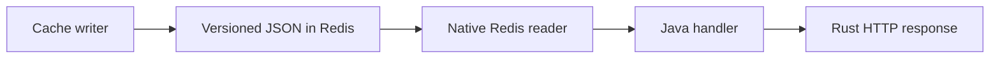

# rest-sample-cache-reader

[English](README.md) | [Türkçe](README.tr.md)

A small REST application that reads ready JSON snapshots from Redis.

- HTTP runs on `rust-java-rest`.
- Redis I/O runs in Rust through `java-rust-cache`.
- Java keeps the handler and business flow.
- This application does not connect to PostgreSQL.
- This application does not write to Redis.

Current versions: `rust-java-rest:4.4.1`, `java-rust-cache:0.7.3`, `rust-sample-model:0.4.1`.

## Read This First

Choose this sample when Redis already contains versioned UTF-8 JSON snapshots and the REST service
only reads them. Do not start here for read-through database access, cache writes, or ad-hoc Redis
key composition.

| Goal | Go to |
| --- | --- |
| Run it locally | [Quick Start](#quick-start) |
| Pick standalone, Sentinel, or Cluster | [Choose the Redis mode](#choose-the-redis-mode) |
| Change only application settings | [Configuration](#configuration) |
| Diagnose a failure | [Common problems](#common-problems) |

The POM uses `rust-java-platform-parent` and one `rust-java-starter-cache-reader` dependency. The
parent aligns REST, cache, DSL-JSON, codegen, and build-gate versions. Code generators stay on the
compiler path; they are not packaged as runtime classes.

## What 0.6.3 Aligns

- `@EnableRustCache` creates one managed native cache lifecycle.
- `@GenerateProjectionReader` generates the bound customer read implementation.
- The application starts with `@ReactorApplication`; the handwritten reader module is removed.
- Redis keys, projection namespaces, REST URLs, and read-only behavior are unchanged.

The optional Glowroot micro telemetry plane is available through the aligned REST `4.4.1` runtime.
It is disabled by default. Enable it only when this service must send bounded HTTP and native Redis
timings to an existing Glowroot Central deployment. No handler or projection code changes.

## Declarative Flow

| You write | Generated or managed for you | Not created in this process |
| --- | --- | --- |
| Projection read contract | Bound projection reader | Redis write pool |
| REST handler | Constructor wiring and route invoker | PostgreSQL connection pool |
| Namespace properties | Cache lifecycle and key plan | Scheduler and distributed lock |
| Readiness dependency | Bounded readiness probe | Full object graph for ready JSON |

Copy the application annotation, the projection contract, and the handler. Do not copy manual
`RustCache` construction or Redis key concatenation into business code.

## Start Here

Use this sample when another process already publishes a Redis read model.

A snapshot is a prepared, versioned data set stored in Redis.

```text
PostgreSQL -> cache writer -> Redis -> this reader -> HTTP client
```



If you need to build the snapshots, start with
[`rest-sample-cache-writer`](https://github.com/esasmer-dou/rest-sample-cache-writer).

## Quick Start

### 1. Publish sample data

Follow the writer quick start. It starts the required containers and publishes the customer snapshots.

### 2. Start this reader

Run from this repository:

```powershell
$env:GITHUB_PACKAGES_TOKEN="YOUR_TOKEN_WITH_READ_PACKAGES"

mvn -q `
  "-Dserver.port=18080" `
  "-Dreactor.cache.redis.host=127.0.0.1" `
  "-Dreactor.cache.redis.port=16379" `
  clean compile exec:java
```

The default application class is already configured in `pom.xml`.

### 3. Call the API

```powershell
curl.exe http://127.0.0.1:18080/app/health
curl.exe http://127.0.0.1:18080/app/readiness
curl.exe http://127.0.0.1:18080/api/v1/cache/customers/1
curl.exe "http://127.0.0.1:18080/api/v1/cache/customers/by-customer-no?customerNo=CUST-1002"
curl.exe http://127.0.0.1:18080/api/v1/cache/customers/segments/pilot
curl.exe http://127.0.0.1:18080/api/v1/cache/customers/statuses/active
curl.exe http://127.0.0.1:18080/api/v1/cache/customers/campaigns/retention/candidates
curl.exe http://127.0.0.1:18080/api/v1/cache/customers/meta
```

`/app/health` only checks the process. `/app/readiness` also checks whether the Redis snapshot exists.

## Main Endpoints

| Endpoint | Returns |
|---|---|
| `GET /api/v1/cache/customers/{id}` | One customer snapshot |
| `GET /api/v1/cache/customers/by-customer-no?customerNo=...` | One customer by business number |
| `GET /api/v1/cache/customers/segments/{segment}` | Customers in a segment |
| `GET /api/v1/cache/customers/statuses/{status}` | Customers with a status |
| `GET /api/v1/cache/customers/campaigns/{campaign}/candidates` | Campaign candidates |
| `GET /api/v1/cache/customers/meta` | Snapshot metadata |
| `GET /api/v1/cache/customers/cache-metrics` | Cache metrics as JSON |

## Choose the Redis Mode

| Environment | Set |
|---|---|
| Local Redis | `reactor.cache.redis.topology=standalone` |
| Redis Sentinel | `reactor.cache.redis.topology=sentinel` plus Sentinel nodes and master name |
| Redis Cluster | `reactor.cache.redis.topology=cluster` plus cluster nodes |

The reader is intentionally read-only:

```properties
reactor.cache.redis.access-mode=read-only
```

Do not enable write capacity in this process unless the application also owns a write use case.

## Configuration

The application reads configuration in this order:

1. `src/main/resources/rust-spring.properties`
2. Files passed through `reactor.config.file` or `REACTOR_CONFIG_FILE`
3. JVM `-D...` values and supported environment variables

Use the local defaults first:

```properties
server.port=8080
reactor.runtime.profile=micro-rest
sample.cache.customer.namespace=crm.customer
reactor.cache.redis.host=127.0.0.1
reactor.cache.redis.port=6379
```

Use the production overlay in a deployment:

```powershell
java "-Dreactor.config.file=src/main/resources/config/production.properties" ...
```

Use advanced tuning only after measuring latency, rejected requests, and process memory (RSS):

```powershell
java "-Dreactor.config.file=src/main/resources/config/production.properties;src/main/resources/config/advanced-tuning.properties" ...
```

| File | Purpose |
|---|---|
| `rust-spring.properties` | Small local defaults |
| `config/production.properties` | Safe production limits and timeouts |
| `config/advanced-tuning.properties` | Route limits, native trim, and namespace overrides |

Reader and writer namespaces must match. If the writer publishes `crm.customer.campaign`, the reader must use the same campaign namespace.

## Code Map

| File | Why it matters |
|---|---|
| `RestSampleCacheReaderApplication.java` | Enables generated REST and Rust cache lifecycle |
| `CacheReaderConfiguration.java` | Declares only the readiness endpoint bean |
| `CustomerCacheService.java` | Declares projection reads; its implementation is generated |
| `CustomerCacheHandler.java` | Exposes REST endpoints |
| `rust-spring.properties` | Local settings |

The frequently used path returns `RawResponse` with the JSON bytes already stored in Redis. It does not rebuild a large Java object tree.

The application does not create `RustCache`, bound projections, or handlers by hand. `@EnableRustCache`
owns native cache startup/shutdown. `@GenerateProjectionReader` binds projection and index names once
at startup. `@ReactorApplication` and constructor injection connect the generated reader to the REST
handler. These helpers are build-time generated and do not add request-time reflection.

## Maven Package Access

GitHub Packages requires a token with `read:packages`. The token also needs access to the private shared sample repositories.

Add these server IDs to `~/.m2/settings.xml`:

```xml
<servers>
  <server>
    <id>github-rust-java-rest</id>
    <username>YOUR_GITHUB_USERNAME</username>
    <password>${env.GITHUB_PACKAGES_TOKEN}</password>
  </server>
  <server>
    <id>github</id>
    <username>YOUR_GITHUB_USERNAME</username>
    <password>${env.GITHUB_PACKAGES_TOKEN}</password>
  </server>
  <server>
    <id>github-rust-sample-model</id>
    <username>YOUR_GITHUB_USERNAME</username>
    <password>${env.GITHUB_PACKAGES_TOKEN}</password>
  </server>
</servers>
```

If Maven returns `401`, check the token, repository access, environment variable, and server IDs.

## Common Problems

| Symptom | Check |
|---|---|
| `401 Unauthorized` during Maven build | GitHub token and `settings.xml` server IDs |
| Readiness is `DOWN` | Run the writer and check the `meta` snapshot |
| Endpoint returns cache miss | Reader and writer data-group namespaces |
| Redis timeout | Redis address, connection mode, and timeout values |
| Native library cannot load in a container | Use a writable `reactor.cache.native.extract-dir` |

## Production Checklist

- Keep `reactor.cache.redis.access-mode=read-only`.
- Keep reader and writer namespace names identical.
- Make readiness fail when the required `meta` snapshot or Redis dependency is unavailable.
- Bound Redis connections, max in-flight reads, response bytes, HTTP connections, and route admission.
- Use Sentinel or Cluster when one Redis node is not an accepted availability boundary.
- Run mixed endpoint c64/c256 load, p99, `503`, RSS, Redis restart/failover, and post-idle checks.
- Do not deserialize prepared JSON into DTOs only to serialize the same body again.

## Glossary

| Term | Meaning |
| --- | --- |
| Snapshot | One consistently published version of a prepared read model |
| Namespace | Stable prefix that separates one projection family from another |
| Projection | Cache shape prepared for one endpoint or query family |
| Read-only mode | Native Redis write resources are not created in this process |
| Readiness | Whether the application can serve real traffic with its required dependencies |

## More Detail

- [Turkish user guide](docs/USER_GUIDE.tr.md)
- [Turkish PDF guide](docs/rest-sample-cache-reader-user-guide.tr.pdf)
- [Production settings](src/main/resources/config/production.properties)
- [Advanced tuning](src/main/resources/config/advanced-tuning.properties)
- [v0.6.3 release notes](docs/RELEASE_NOTES_v0.6.3.md)
