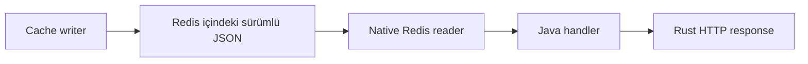

# rest-sample-cache-reader

[English](README.md) | [Türkçe](README.tr.md)

Redis'te hazır duran JSON snapshot'larını REST API ile sunan küçük bir uygulamadır.

- HTTP trafiğini `rust-java-rest` karşılar.
- Redis I/O işlemlerini `java-rust-cache` üzerinden Rust yapar.
- Handler ve iş akışı Java'da kalır.
- Bu uygulama PostgreSQL'e bağlanmaz.
- Bu uygulama Redis'e veri yazmaz.

Kullanılan sürümler: `rust-java-rest:4.5.6`, `java-rust-cache:0.7.5`, `rust-sample-model:0.4.2`.

## Önce Bu Bölümü Okuyun

Redis içinde sürümlü UTF-8 JSON snapshot'ları zaten varsa ve REST uygulaması yalnız okuyacaksa bu
sample doğru başlangıçtır. Read-through database erişimi, cache yazma veya elle Redis key birleştirme
için bu projeden başlamayın.

| Hedef | Bölüm |
| --- | --- |
| Lokal çalıştırmak | [Hızlı Başlangıç](#hızlı-başlangıç) |
| Standalone, Sentinel veya Cluster seçmek | [Redis Modunu Seçin](#redis-modunu-seçin) |
| Yalnız uygulama ayarını değiştirmek | [Konfigürasyon](#konfigürasyon) |
| Glowroot telemetrisini açmak | [Glowroot Agent ile Telemetri](#glowroot-agent-ile-telemetri) |
| Hata çözmek | [Sık Karşılaşılan Sorunlar](#sık-karşılaşılan-sorunlar) |

POM, `rust-java-platform-parent` ve tek bir `rust-java-starter-cache-reader` bağımlılığı kullanır.
Parent; REST, cache, DSL-JSON, codegen ve build gate sürümlerini birlikte yönetir. Kod üreteçleri
yalnız derleyici yolunda kalır. Runtime sınıfı olarak pakete girmez.

## 0.6.5 ile Neler Hizalandı?

- `@EnableRustCache` tek bir managed native cache lifecycle oluşturur.
- `@GenerateProjectionReader`, customer read implementasyonunu build sırasında üretir.
- Uygulama `@ReactorApplication` ile başlar. Elle yazılmış reader module kaldırıldı.
- Redis key'leri, projection namespace'leri, REST adresleri ve read-only davranış değişmedi.
- REST ve cache artık temiz native ABI `29/7/6/3` provenance hattını birlikte kullanır.

İsteğe bağlı Glowroot mikro telemetri katmanı, uyumlu REST `4.5.6` çalışma katmanıyla kullanılabilir.
Varsayılan olarak kapalıdır. Yalnız bu servis mevcut Glowroot Central kurulumuna sınırlandırılmış HTTP
ve native Redis süreleri gönderecekse açın. Handler veya projection kodu değişmez.

## Deklaratif Akış

| Sizin yazdığınız kod | Framework'ün ürettiği veya yönettiği alan | Bu process'te hiç açılmayan alan |
| --- | --- | --- |
| Projection okuma kontratı | Bağlanmış projection reader | Redis write pool |
| REST handler | Constructor bağlantısı ve route invoker | PostgreSQL connection pool |
| Namespace property'leri | Cache lifecycle ve key planı | Scheduler ve distributed lock |
| Readiness dependency | Bounded readiness kontrolü | Hazır JSON için tekrar object graph |

Application annotation, projection kontratı ve handler kodunu alın. Business kodunda elle
`RustCache` oluşturmayın ve Redis key birleştirmeyin.

## Buradan Başlayın

Başka bir uygulama Redis read modelini hazırlıyorsa bu sample'ı kullanın.

Snapshot, Redis'e belirli bir sürümle yazılmış hazır veri setidir.

```text
PostgreSQL -> cache writer -> Redis -> bu reader -> HTTP istemcisi
```



Snapshot üretmeniz gerekiyorsa önce
[`rest-sample-cache-writer`](https://github.com/esasmer-dou/rest-sample-cache-writer) projesini çalıştırın.

## Hızlı Başlangıç

### 1. Örnek veriyi yayınlayın

Writer sample'ı bir kez çalıştırın. Writer, PostgreSQL verisini okuyup Redis snapshot'larını oluşturur.

### 2. Reader'ı başlatın

Bu repo dizininde çalıştırın:

```powershell
$env:GITHUB_PACKAGES_TOKEN="READ_PACKAGES_YETKILI_TOKEN"

mvn -q `
  "-Dserver.port=18080" `
  "-Dreactor.cache.redis.host=127.0.0.1" `
  "-Dreactor.cache.redis.port=16379" `
  clean compile exec:java
```

Başlangıç sınıfı `pom.xml` içinde hazırdır.

### 3. API'yi çağırın

```powershell
curl.exe http://127.0.0.1:18080/app/health
curl.exe http://127.0.0.1:18080/app/readiness
curl.exe http://127.0.0.1:18080/api/v1/cache/customers/1
curl.exe "http://127.0.0.1:18080/api/v1/cache/customers/by-customer-no?customerNo=CUST-1002"
curl.exe http://127.0.0.1:18080/api/v1/cache/customers/segments/pilot
curl.exe http://127.0.0.1:18080/api/v1/cache/customers/statuses/active
curl.exe http://127.0.0.1:18080/api/v1/cache/customers/campaigns/retention/candidates
curl.exe http://127.0.0.1:18080/api/v1/cache/customers/meta
```

`/app/health` yalnızca uygulamayı kontrol eder. `/app/readiness`, Redis snapshot'ının hazır olup olmadığını da kontrol eder.

## Temel Endpoint'ler

| Endpoint | Dönen veri |
|---|---|
| `GET /api/v1/cache/customers/{id}` | Tek müşteri snapshot'ı |
| `GET /api/v1/cache/customers/by-customer-no?customerNo=...` | Müşteri numarasına göre tek müşteri |
| `GET /api/v1/cache/customers/segments/{segment}` | Bir segmentteki müşteriler |
| `GET /api/v1/cache/customers/statuses/{status}` | Bir durumdaki müşteriler |
| `GET /api/v1/cache/customers/campaigns/{campaign}/candidates` | Kampanya adayları |
| `GET /api/v1/cache/customers/meta` | Snapshot bilgisi |
| `GET /api/v1/cache/customers/cache-metrics` | JSON cache metrikleri |

## Redis Modunu Seçin

| Ortam | Ayar |
|---|---|
| Lokal Redis | `reactor.cache.redis.topology=standalone` |
| Redis Sentinel | `reactor.cache.redis.topology=sentinel`, Sentinel node'ları ve master adı |
| Redis Cluster | `reactor.cache.redis.topology=cluster` ve cluster node'ları |

Reader bilinçli olarak yalnızca okuma yapar:

```properties
reactor.cache.redis.access-mode=read-only
```

Bu uygulama Redis'e veri yazmayacaksa write kapasitesini açmayın.

## Konfigürasyon

Uygulama ayarları şu sırayla okur:

1. `src/main/resources/rust-spring.properties`
2. `reactor.config.file` veya `REACTOR_CONFIG_FILE` ile verilen dosyalar
3. JVM `-D...` değerleri ve desteklenen environment variable'lar

Önce lokal varsayılanlarla başlayın:

```properties
server.port=8080
reactor.runtime.profile=micro-rest
sample.cache.customer.namespace=crm.customer
reactor.cache.redis.host=127.0.0.1
reactor.cache.redis.port=6379
```

Deployment sırasında production ayarlarını ekleyin:

```powershell
java "-Dreactor.config.file=src/main/resources/config/production.properties" ...
```

İleri seviye ayarları yalnızca gecikme, reddedilen istek ve process memory (RSS) ölçümü yaptıktan sonra kullanın:

```powershell
java "-Dreactor.config.file=src/main/resources/config/production.properties;src/main/resources/config/advanced-tuning.properties" ...
```

| Dosya | Amacı |
|---|---|
| `rust-spring.properties` | Küçük lokal varsayılanlar |
| `config/production.properties` | Güvenli production limitleri ve timeout'lar |
| `config/advanced-tuning.properties` | Route limitleri, native trim ve namespace override'ları |

Reader ve writer namespace değerleri aynı olmalıdır. Writer `crm.customer.campaign` namespace'ine yazıyorsa reader da aynı değeri okumalıdır.

## Glowroot Agent ile Telemetri

Bu uygulama Rust-Java REST üzerinde çalışır. Ayrı bir Spring starter veya agent çalışma katmanı
gerekmez. Telemetri varsayılan olarak kapalıdır. Açıldığında HTTP route ve native Redis read süreleri
aynı Rust çalışma katmanında toplanır. Handler ve projection kodu değişmez.

Bu sample, Glowroot ABI `3` taşıyan production platform `4.5.6` sürümünü kullanır. İsteğe bağlı
`java-rust-glowroot-agent:0.4.0` JAR'ı yalnız `-javaagent` biçimi gerekiyorsa eklenir. REST içine
gömülü telemetri runtime'ı için ayrı agent dependency gerekmez:

```xml
<parent>
  <groupId>com.reactor</groupId>
  <artifactId>rust-java-platform-parent</artifactId>
  <version>4.5.6</version>
  <relativePath/>
</parent>
```

Lokal kullanım için `rust-spring.properties` dosyasına şu değerleri ekleyin:

```properties
reactor.glowroot.enabled=true
reactor.glowroot.profile=micro
reactor.glowroot.collector.address=http://127.0.0.1:8181
reactor.glowroot.agent.id=cache-reader-local
reactor.glowroot.application.name=rest-sample-cache-reader
reactor.glowroot.http.sample-rate=256
reactor.glowroot.trace.capacity=0
```

`reactor.native.capabilities` değerini ayrıca tanımlıyorsanız gerekli yüzeyleri açıkça ekleyin:

```properties
reactor.native.capabilities=http,redis,glowroot
```

Kubernetes'te aynı ayarları environment variable olarak verin:

```yaml
env:
  - name: REACTOR_GLOWROOT_ENABLED
    value: "true"
  - name: REACTOR_GLOWROOT_PROFILE
    value: "micro"
  - name: REACTOR_GLOWROOT_COLLECTOR_ADDRESS
    value: "http://glowroot-collector.observability.svc.cluster.local:8181"
  - name: REACTOR_GLOWROOT_AGENT_ID
    valueFrom:
      fieldRef:
        fieldPath: metadata.name
  - name: REACTOR_GLOWROOT_APPLICATION_NAME
    value: "rest-sample-cache-reader"
```

Uygulama başladıktan sonra agent durumunu kontrol edin:

```powershell
curl.exe http://127.0.0.1:18080/diagnostics/glowroot
```

| İhtiyaç | Profil | Kullanım |
|---|---|---|
| Normal production trafiği | `micro` | HTTP, Redis, RSS, thread ve exporter sağlığı |
| Heap veya GC araştırması | `jvm` | Tek podda geçici olarak açın |
| SQL ölçümü | Kullanmayın | Reader PostgreSQL'e bağlanmaz |
| Hata ve JVM incelemesi | `full` | Kısa inceleme süresi için kullanın |
| Thread veya heap çıktısı | `diagnostic` | Yalnız yetkili operasyon sırasında açın |

`micro` production gate'i en fazla bir exporter thread'i ve `3 MiB` yerleşik bellek sınırıyla
doğrulanmıştır. Collector erişilemezse reader trafiği devam eder. Gönderilemeyen telemetri sınırlı
drop sayaçlarına yansır. `/diagnostics/glowroot` endpoint'ini public ingress'e açmayın.

Agent'i kullanmayacaksanız şu varsayılanı koruyun:

```properties
reactor.glowroot.enabled=false
```

Ayrıntılı profil ve çalışma sırasında geçiş örnekleri için
[`java-rust-glowroot-agent`](https://github.com/esasmer-dou/java-rust-glowroot-agent/blob/master/README.tr.md)
dokümanını kullanın.

## Kod Haritası

| Dosya | Görevi |
|---|---|
| `RestSampleCacheReaderApplication.java` | Generated REST ve Rust cache lifecycle'ını açar |
| `CacheReaderConfiguration.java` | Yalnız readiness endpoint bean'ini tanımlar |
| `CustomerCacheService.java` | Projection okumalarını tanımlar; implementasyon üretilir |
| `CustomerCacheHandler.java` | REST endpoint'lerini açar |
| `rust-spring.properties` | Lokal ayarları taşır |

Yoğun çağrı alan akış, Redis'te hazır duran JSON byte'larını `RawResponse` ile döner. Büyük bir Java nesne ağacını yeniden oluşturmaz.

Uygulama `RustCache`, bound projection veya handler nesnelerini elle kurmaz. `@EnableRustCache`, native
cache başlangıç ve kapanışını yönetir. `@GenerateProjectionReader`, projection ve index adlarını
başlangıçta bir kez bağlar. `@ReactorApplication` ve constructor injection, generated reader'ı REST
handler'a bağlar. Bu yardımcılar derleme sırasında üretilir. Request sırasında reflection eklemez.

## Maven Package Erişimi

GitHub Packages için `read:packages` yetkili token gerekir. Token'ın private ortak sample repolarına da erişimi olmalıdır.

Şu server kimliklerini `~/.m2/settings.xml` dosyasına ekleyin:

```xml
<servers>
  <server>
    <id>github-rust-java-rest</id>
    <username>GITHUB_KULLANICI_ADI</username>
    <password>${env.GITHUB_PACKAGES_TOKEN}</password>
  </server>
  <server>
    <id>github</id>
    <username>GITHUB_KULLANICI_ADI</username>
    <password>${env.GITHUB_PACKAGES_TOKEN}</password>
  </server>
  <server>
    <id>github-rust-sample-model</id>
    <username>GITHUB_KULLANICI_ADI</username>
    <password>${env.GITHUB_PACKAGES_TOKEN}</password>
  </server>
</servers>
```

Maven `401` dönerse token'ı, repo erişimini, environment variable'ı ve server kimliklerini kontrol edin.

## Sık Karşılaşılan Sorunlar

| Belirti | Kontrol edin |
|---|---|
| Maven build sırasında `401 Unauthorized` | GitHub token ve `settings.xml` server kimlikleri |
| Readiness `DOWN` | Writer çalıştı mı ve `meta` snapshot'ı var mı? |
| Endpoint cache miss dönüyor | Reader ve writer veri grubu namespace değerleri |
| Redis timeout oluşuyor | Redis adresi, bağlantı biçimi ve timeout değerleri |
| Container native kütüphaneyi yükleyemiyor | Yazılabilir `reactor.cache.native.extract-dir` dizini |
| Glowroot verisi görünmüyor | `enabled`, collector adresi, agent id ve `/diagnostics/glowroot` çıktısı |

## Production Kontrol Listesi

- `reactor.cache.redis.access-mode=read-only` değerini koruyun.
- Reader ve writer namespace adlarını aynı tutun.
- Gerekli `meta` snapshot veya Redis erişilemiyorsa readiness `DOWN` olmalıdır.
- Redis connection, max-in-flight read, response byte, HTTP connection ve route admission değerlerini sınırlayın.
- Tek Redis node kabul edilen availability sınırı değilse Sentinel veya Cluster kullanın.
- Karışık endpoint ile c64/c256 yük, p99, `503`, RSS, Redis restart/failover ve yük sonrası idle testi yapın.
- Hazır JSON'u yalnız tekrar serialize etmek için DTO'ya çevirmeyin.
- Agent açıksa `micro` ile başlayın; geniş profilleri yalnız kısa ve yetkili inceleme için açın.

## Kısa Sözlük

| Terim | Basit anlamı |
| --- | --- |
| Snapshot | Hazırlanmış okuma modelinin tutarlı biçimde yayınlanmış bir sürümü |
| Namespace | Bir projection ailesini diğerinden ayıran sabit key prefix'i |
| Projection | Bir endpoint veya sorgu ailesi için hazırlanmış cache biçimi |
| Read-only mode | Bu process içinde native Redis write kaynaklarının oluşturulmaması |
| Readiness | Uygulamanın gerekli bağımlılıklarıyla gerçek trafik sunabilme durumu |
| Telemetri profili | Agent'in o anda topladığı veri ve ayırdığı sınırlı kaynak yüzeyi |

## Ayrıntılı Bilgi

- [Türkçe kullanıcı rehberi](docs/USER_GUIDE.tr.md)
- [Türkçe PDF rehberi](docs/rest-sample-cache-reader-user-guide.tr.pdf)
- [Production ayarları](src/main/resources/config/production.properties)
- [Advanced tuning ayarları](src/main/resources/config/advanced-tuning.properties)
- [v0.6.5 sürüm notları](docs/RELEASE_NOTES_v0.6.5.tr.md)
