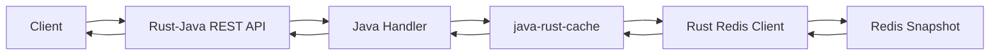

# rest-sample-cache-reader Kullanıcı Rehberi

Bu rehber ilk kullanım içindir.

Amaç kısa ve nettir: Redis içinde hazır duran JSON verisini REST API olarak döndürmek.

## İçindekiler

1. [Bu Proje Ne İşe Yarar?](#bu-proje-ne-işe-yarar)
2. [Akış Nasıl Çalışır?](#akış-nasıl-çalışır)
3. [Ne Zaman Kullanılır?](#ne-zaman-kullanılır)
4. [Hızlı Başlangıç](#hızlı-başlangıç)
5. [Endpoint'ler](#endpointler)
6. [Önemli Ayarlar](#önemli-ayarlar)
7. [Production Reçeteleri](#production-reçeteleri)
8. [Sık Hatalar](#sık-hatalar)

## Bu Proje Ne İşe Yarar?

`rest-sample-cache-reader`, düşük memory hedefli bir REST cache reader örneğidir.

Uygulama DB'ye gitmez. Scheduler çalıştırmaz. Dubbo kullanmaz.

Sadece Redis'ten okur ve HTTP JSON response döner.

## Akış Nasıl Çalışır?



Java tarafı business route kararını verir.

Redis I/O Rust tarafındadır. Bu yüzden Java Redis client ve ekstra Netty yüzeyi yoktur.

## Ne Zaman Kullanılır?

| Senaryo | Bu proje uygun mu? | Neden |
|---------|--------------------|-------|
| Redis'te hazır JSON var | Evet | En düşük maliyetli read path budur. |
| API DB'ye anlık query atacak | Hayır | Bu proje DB bağlantısı açmaz. |
| Çok düşük RSS isteniyor | Evet | `micro-rest` ve küçük Redis pool ile çalışır. |
| Cache yoksa DB fallback isteniyor | Hayır | Fallback başka servis veya writer sorumluluğudur. |
| Read-heavy lookup API | Evet | Hazır snapshot okur, DTO graph kurmaz. |

## Hızlı Başlangıç

Redis'i başlatın:

```powershell
docker run --name sample-redis -p 6379:6379 -d redis:7-alpine
```

Uygulamayı Maven ile çalıştırın:

```powershell
mvn -q package
java -jar target/rest-sample-cache-reader-0.1.0.jar
```

Health kontrolü:

```powershell
curl http://127.0.0.1:8080/app/health
```

Cache hazır değilse customer endpoint'leri `404` dönebilir. Bu normaldir. Önce writer uygulaması Redis'e snapshot yazmalıdır.

## Endpoint'ler

| Endpoint | Ne döner? | Ne zaman kullanılır? |
|----------|-----------|----------------------|
| `GET /app/health` | Uygulama sağlık bilgisi | Pod health check |
| `GET /api/v1/cache/customers/{id}` | Customer detail JSON | ID ile hızlı okuma |
| `GET /api/v1/cache/customers/by-customer-no?customerNo=CUST-1` | Customer detail JSON | Business key ile okuma |
| `GET /api/v1/cache/customers/segments/{segment}` | Segment listesi | Liste veya dashboard |
| `GET /api/v1/cache/customers/statuses/{status}` | Status listesi | Aktif/pasif müşteri listesi |
| `GET /api/v1/cache/customers/campaigns/{campaign}/candidates` | Kampanya adayları | Read-heavy kampanya ekranı |
| `GET /api/v1/cache/customers/meta` | Snapshot meta bilgisi | Cache hazır mı kontrolü |
| `GET /api/v1/cache/customers/cache-metrics` | Cache metrikleri | Operasyonel kontrol |

Örnek:

```powershell
curl http://127.0.0.1:8080/api/v1/cache/customers/1
```

## Önemli Ayarlar

| Property | Ne işe yarar? | Ne zaman değiştirilir? |
|----------|---------------|------------------------|
| `reactor.runtime.profile=micro-rest` | REST runtime'ı düşük RSS için dar tutar. | Genelde değiştirmeyin. |
| `sample.cache.customer.namespace=crm.customer` | Redis key alanını belirler. | Aynı Redis'te birden fazla domain varsa değiştirin. |
| `sample.cache.customer.projections=detail,segment,status,campaign,meta` | Hangi projection'lar okunacak belirler. | Writer ile aynı olmalıdır. |
| `sample.cache.customer.version-cache-ms=1000` | Aktif snapshot version bilgisini kısa süre cache'ler. | Çok sık version değişiyorsa düşürün. |
| `reactor.cache.redis.topology=standalone` | Redis bağlantı tipidir. | Sentinel veya Cluster kullanıyorsanız değiştirin. |
| `reactor.cache.redis.max-read-inflight=64` | Aynı anda kaç Redis read uçuşta olabilir. | p99 ve RSS birlikte ölçülerek artırılır. |
| `reactor.cache.redis.max-response-bytes=1048576` | Tek Redis response üst limitidir. | Büyük JSON okuyorsanız artırın. |

## Production Reçeteleri

| İhtiyaç | Başlangıç ayarı | Etki |
|---------|-----------------|------|
| En küçük pod | `micro-rest`, `max-read-inflight=32-64` | RSS düşük kalır, spike anında fail-fast olabilir. |
| Redis Sentinel | `reactor.cache.redis.topology=sentinel` ve `reactor.cache.redis.nodes=...` | Redis master değişimini takip eder. |
| Redis Cluster | `reactor.cache.redis.topology=cluster` ve cluster node listesi | Büyük key alanı için uygundur. |
| Büyük JSON | `max-response-bytes` artırılır | Memory bütçesini ayrıca ölçmek gerekir. |

## Sık Hatalar

| Belirti | Muhtemel neden | Çözüm |
|---------|----------------|-------|
| `404 customer_cache_not_ready` | Writer henüz snapshot yazmadı. | Writer'ı çalıştırın ve `meta` endpoint'ini kontrol edin. |
| p99 yükseliyor | Redis yavaş veya in-flight fazla. | `max-read-inflight` değerini düşürün, Redis latency ölçün. |
| RSS büyüyor | Büyük JSON veya çok fazla concurrent response var. | Response boyutunu ve route concurrency değerlerini düşürün. |
| Cluster/Sentinel bağlanmıyor | Yanlış topology veya node listesi. | `reactor.cache.redis.topology` ve `reactor.cache.redis.nodes` değerlerini birlikte kontrol edin. |

